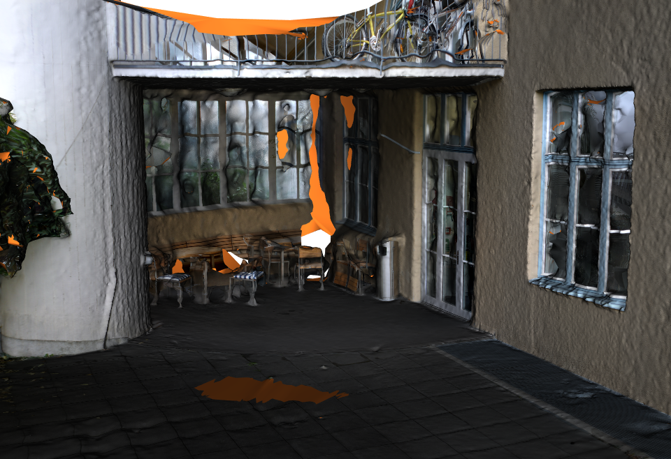

# ETH3D Dataset Processing with Python

## Visualization


```python
vc=Visualizer()
vc.plotMVS()
vc.plotLiDAR()
vc.plotMeshes()
```
<p float="left">
  
  
</p>


<p float="left">
  
  
</p>


<p float="left">
  
  
</p>